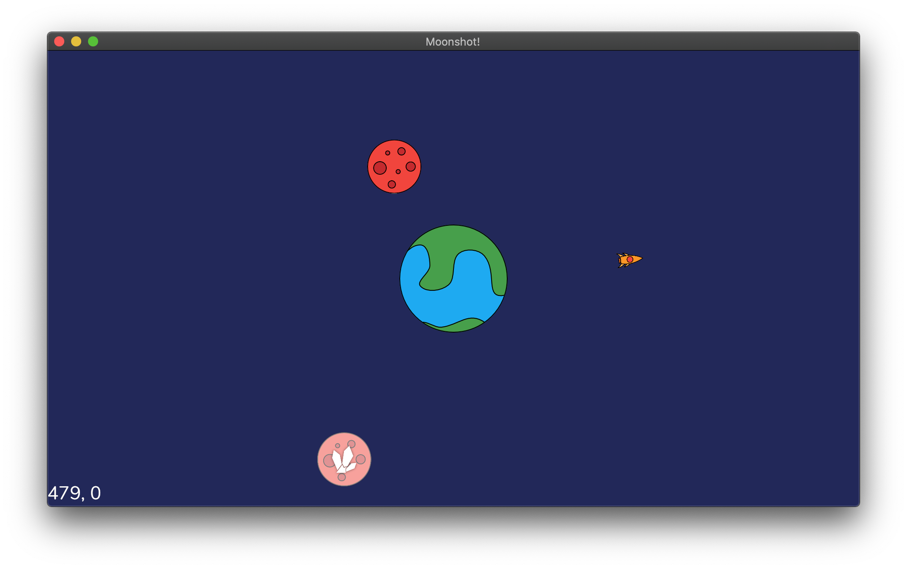

# Moonshot

This will be my contribution to GitHub's 2020 Game Off.

I am writing a strategy game in Rust using the [Amethyst](https://amethyst.rs/) game engine.
The game plays in space and will probably have something to do with mining moons for minerals,
destroying your opponent's moons, and flying around with rockets.

## Getting Started

The game is currently only built on macOS.
To run the game on Windows/Linux you have to replace the `metal` feature flag with `vulkan` in the `Cargo.toml` file.
You will also have to install some additional dependencies.
See the [Amethyst GitHub page](https://github.com/amethyst/amethyst#dependencies) for more information.
